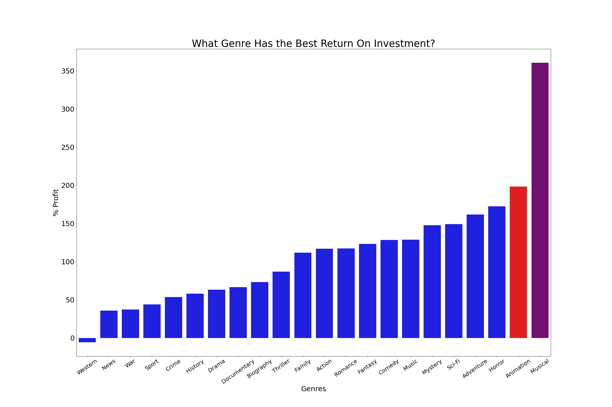
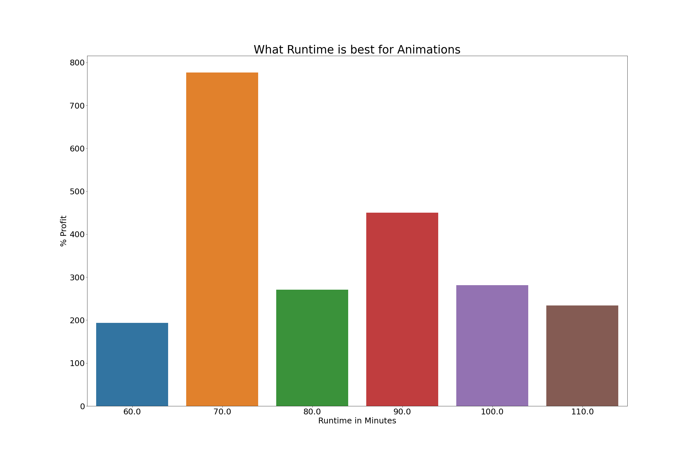
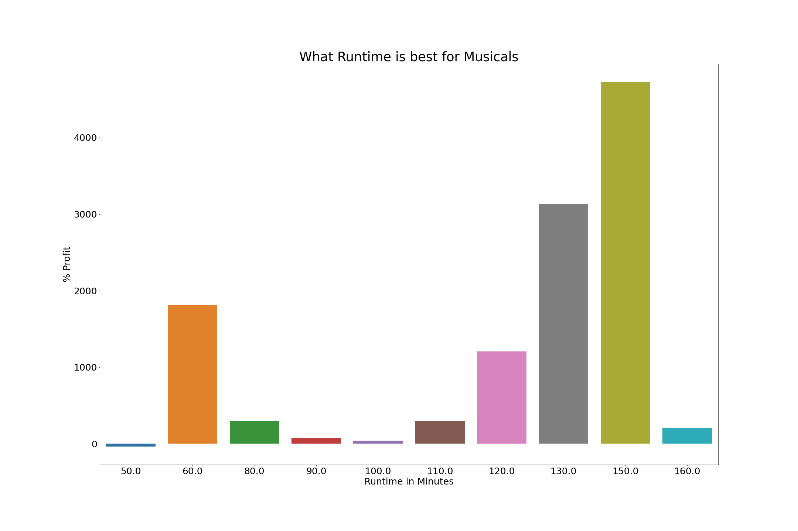

# Title

**Authors**: Daniel Blake, Lorin Helfenstein, Andre Isaac Yu Tiamco

## Overview

In this analysis the metric of what makes a good film will be analized through the lens of profit and critique review. Analysis of profit in the form of percentage shows that some of the most popular movie generes are musicals and animated. By the end of this document you will be able to see the reasons why we would recomend to make these movies to the Microsoft Corporation.

## Business Problem

The Microsoft Corporation has tasked us to find what makes a film succesful in the hopes of starting their own film franchise. Through our analysis, Microsoft will be able to make an informed descision on the qualities of a successful film.

## Data
In this analysis multiple dataframes were used, primarily from Rotten Tomatoes and IMDB. These data sets include movie titles, genres, budgets, runtimes, and reviews, as well as many other items used to find what makes a film succesful.

## Methods

This project uses the analysis of a profit percentage to determain what genre makes a succesful film. As well as the use of the analysis of runtime within those generes to see what is the most profitable runtime. These analyses were performed using the IMDB datatables. An additional investigation into the overall reception was performed with the Rotten Tomatoes datatables. Here, review scores and freshness ratings were primary determinants of how well a movie was recieved by audiences.

## Results
### Visual 1

The main results that we have found within our data sets is that the most profitable movies are Musicals and Animated films. The profit we calculated as a percentage and it is the pure profit after the cost of the production. Within our data analysis the results point to Musical and Animated films. Within these films we learn what is the best length for these films shown in the graphs below.

### Visual 3

### Visual 4

### Visual 5

## Conclusions

Animations and Musicals are killing it in the industry.  Actor reccommendations include Alan Tudyk and J.K. Simmons.

## For More Information

Please review our full analysis in [our Jupyter Notebook]('./The_Notebook.ipynb') or our [presentation]('./project_1_powerpoint.pdf').

For any additional questions, please contact 
Daniel Blake: dablake@bsc.edu
Lorin Helfenstein: lehelfen@bsc.edu  
Andre Isaac Yu Tiamco: acyutiam@bsc.edu

## Repository Structure

├── README.md                           <- The top-level README for reviewers of this project

├── The Notebook.ipynb                  <- Narrative documentation of analysis in a Jupyter notebook

├── project 1 powerpoint.pdf            <- PDF version of project presentation

├── data                                <- Sourced externally and generated from code

└── images                              <- Code generated visualizations of data
